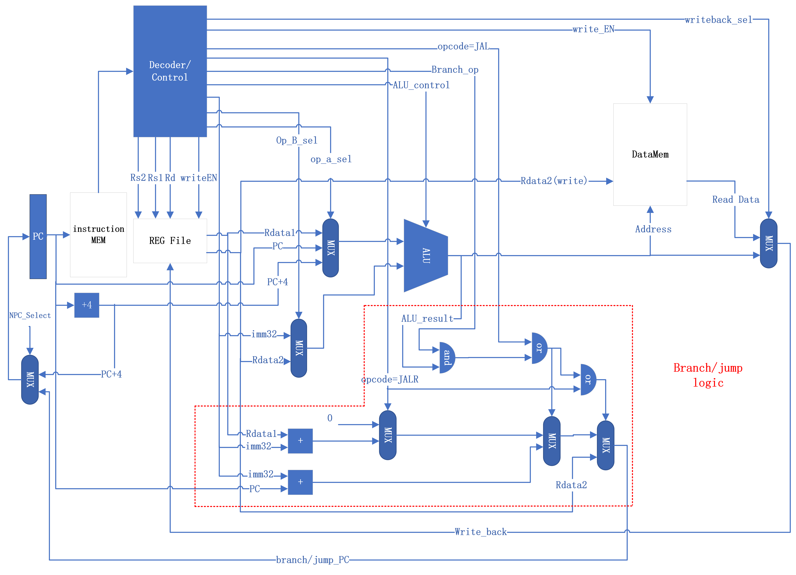

# riscv_CPU
Use Verilog to implement a riscv CPU, from single cycle to pipeline.
## Single cycle diagram:

## Dependency
iverilog: https://bleyer.org/icarus/

riscv-gnu-toolchain: https://github.com/riscv-collab/riscv-gnu-toolchain
## Getting started
Open tb/Top_tb.v and change the line:

$readmemh("./Sim/asm2hex/build/Function_you_want.hex", CPU.IMEM.Mem);

The simulation hexadecimal instruction input file is in: 

Sim/asm2hex/build/

Run:
```
source run_script.sh
```
This command will use icarus verilog to compile and simulate the files.

The output is generated in:

Sim/my_test_result/

The waveform is in waveform.vcd
## Testbench construction

To test the function of the CPU, you need to construct the assembly language instructions that you want to test, and using riscv-gnu-toolchain to intepret it to the hexadecimal file that can be read by Top_tb.v

In this project, you can directly write the assembly language, or write C and convert it to assembly.

To generate the assembly language instructions from C file, you can
```
cd Sim/c2asm/src
# create your .c file here
cd ..
make NAME= "the name of your C file"
```
The output .s file is in ./build/

To generate the hexadecimal/binary file from assembly files, you can
```
cd Sim/asm2hex/src
# put your .s file here
cd ..
make NAME="the name of your assembly file"
```
The output .hex and .bin file is in ./build/

The suggested format is already in the src folder for reference.


